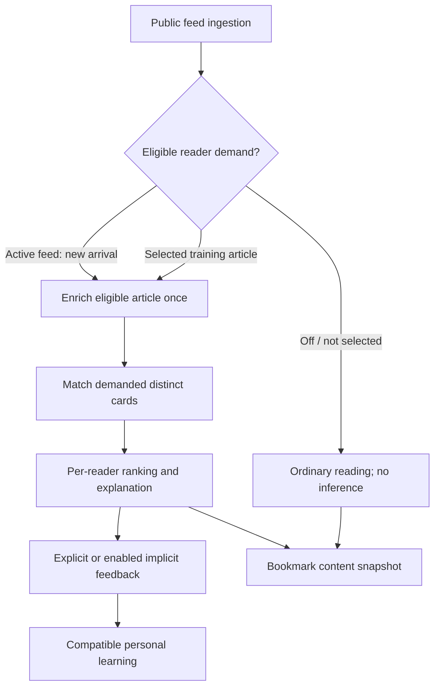

# Bantoozi: background and rationale

> This file explains *why* the plan looks the way it does. It covers lessons from the two earlier
> prototypes, what the Jev demos and docs taught us, and the risks. It is reference material. The
> executable plan is [`PLAN.md`](./PLAN.md), and the detailed specs are in [`specs/`](./specs/).
> Nothing here overrides a spec. If they disagree, the spec wins.
>
> **Review note (2026-09-25):** provider benchmarks, prices, limits and community-model claims below
> are dated research inputs, not measured Bantoozi results. The specs require capability preflight,
> workload-based cost measurement and held-out evaluation. Owner decisions are tracked in PLAN §17.
> The owner's follow-up makes inference opt-in per feed, bookmarks durable full-content snapshots,
> library upgrades opt-in and labels neutral. Final decisions allow publication after 30 days of creator
> inactivity, accept a passing owner-only pilot for initial beta, and exclude media from bookmark archives.
> Those decisions supersede earlier hypotheses below.
>
> **Review note (2026-09-29):** independent tests published after Jev's public launch are summarized
> in §2.4 and the access changes in §3.1. They support the design's use of Jev, correct the earlier
> claim that its probabilities are calibrated, and led to design revision R3 (PLAN §17.4).

## 1. The idea in one page

FeedIt had one core promise: **"show me only the articles I care about, and learn what that means
from my likes and dislikes."** Both earlier attempts tried to deliver this by building a scoring
engine by hand:

- **FeedIt.sk** scored title words, trigrams, authors, categories and phrases per user and per feed. It combined
  them with hand-tuned constants (`+1`, `+25`, `0.1`, `0.01`, a "well-trained" threshold of `163`, tier
  cut-offs of 5/10/30/50 %).
- **DreamCatcher** planned embeddings, hybrid RAG search and a slow generative-LLM pass that returned a
  JSON score, tags and reasons for every article. That pass was never built.

The next generation replaces the hand-built scoring with **TypeSafe's Jev**, a "System One" decision
model. You send Jev a *state* (the article) and a set of typed *questions* (Choice / Score / Noul). It
returns probabilities plus a confidence value in under a second (TypeSafe says 70–500 ms; an
independent benchmark measured a 0.65 s median, §2.4). It costs $0.042 per million input
tokens, and output is free. It returns typed decisions rather than free-form text; those decisions
can still be wrong and need held-out measurement and recoverable user controls. TypeSafe calls the
probabilities calibrated, but an independent test found that true for Noul far more than for Choice
or Score (§2.4), so Bantoozi treats every answer as a score and sets its cutoffs on its own labels.

The design in one picture:

Five ideas carry most of the design:

1. **Interest cards instead of word weights.** A user describes what they want in plain language
   ("new EV battery chemistry, not stock-price news"). The system also offers cards from a shared
   library. Jev evaluates only selected training articles or active-feed arrivals against applicable
   cards. Cards can produce useful first results without fitting a personal model, but never silently
   turn inference on for an untrained subscription.
2. **Reuse eligible article analysis.** When at least one reader requests it, per-article enrichment
   can be shared across eligible tenants; an off subscription creates no such demand. DreamCatcher's global article store already works this way, so reuse it.
3. **Measurement replaces hand balancing.** Jev's answers are good scores, not guaranteed
   probabilities (§2.4). Lane, tier and demotion cutoffs are chosen on blind human ratings and labels
   at gate G1 instead of hand-tuned percent thresholds. When per-user learning is needed, a tiny
   logistic model learns the weights and its own calibration from the user's ratings, so nobody has
   to tune them.
4. **Confidence is a product feature.** Confident "no" items sink to *Everything else*; only
   never-cards and the reader's own rules or preferences hide an article. Low-confidence items go to a
   *Maybe* lane and are the articles the app asks you to rate. This is active learning: you only train
   where the model is unsure.
5. **Feedback carries reasons, not just a sign.** A 👎 comes with an optional one-tap reason
   ("off-topic", "clickbait", "already seen this story", "too shallow", "promo"). Each reason maps onto a
   Jev question that already exists, so a dislike becomes negative evidence. The old engine could never
   use dislikes that way.

---

## 2. What we learned from the two predecessors

### 2.1 [FeedIt.sk](https://github.com/martinambrus/feedit.sk): keep the UX, drop the scoring engine

**Worth keeping**

- The whole interaction model, which is the reason the product exists:
  - swipe or keyboard like/dislike (`js/train-on-swipe.js`, CTRL+PLUS/MINUS)
  - "train the whole feed" in one action
  - Simple Mode
  - a 1–5 tier slider with "Hide non-interesting"
  - sort by score or by date
  - status filters: unread, untrained, trained+, all
  - bookmarks protecting items from archiving
  - labels with *suggested* labels you tap to make permanent
  - per-feed settings: duplicates allowed, language, manual priorities, adjustment phrases
- Passwordless email-code login.
- The "detailed training" modal, which *explains* what the system thinks about an article. The concept
  stays, but it now shows interest-card matches and article facets instead of word weights.
- Duplicate detection: FeedIt already compared link, title + first 80 characters of the description,
  and image. DreamCatcher only dedups per feed, so this is a regression to fix.
- Ideas from `todo.txt` that the new design makes cheap:
  - temporary keyword muting (e.g. for a Google News story you have already read)
  - the "did you like it?" prompt after returning from an article
  - article-length buckets
  - per-article language
  - linked feeds / copying training between feeds. With interest cards this comes free, because cards
    are not tied to a feed.
  - OPML import and export

**What went wrong, and why the new design avoids it**

| FeedIt.sk problem | Root cause | Next-gen answer |
|---|---|---|
| Only the **title** is scored. The description and body are ignored. | Word statistics need clean, short text. | Jev reads title, excerpt and the start of the body as structured state. |
| **Dislikes teach almost nothing.** They only raise `weightings`, which dilutes the interest %. | Positive-evidence-only word counting. | A dislike + reason is a labelled example for the per-user model and maps to explicit negative features. |
| Magic constants: `+25` trigrams, `0.1` authors, `0.01` categories, `163`, 5/10/30/50 %, ±300/±3000 boosts that push interest % into the thousands. | Hand-balancing heterogeneous signals. | Calibrated probabilities. Where weights are needed, they are *learned*. |
| Cold start: a feed needs ≥200 articles, 32 % trained and ≥4 % liked before tiers work. The "well-trained" flag is never re-evaluated. | Nothing works until statistics accumulate. | Interest cards work on article #1. Learning only *refines* them. |
| Every vote runs `updateMany` over every unread article containing the word. | Scores are denormalized into each article row. | Jev answers are stored once. Ranking is a cheap per-user function evaluated at read time or incrementally. |
| Per-user collections (`words-<id>`, `training-<id>` …), and crons process only the first 100 accounts (`limit => 100`, sorted on a non-existent field). | Tenancy bolted onto per-user collections. | Proper relational multi-tenancy with a shared article layer and per-user state tables. |
| Labels are predicted by word overlap with previously labelled titles. | Nothing better was available. | A label *is* a question: user-defined labels become Nouls or a Choice over label descriptions. |
| Training is per feed and cannot be shared (`todo.txt`: "mighty complicated due to all dependencies of dependencies"). | Word weights are tied to feed vocabularies. | Interest cards are feed-independent by construction. |

### 2.2 DreamCatcher: keep the ingestion pipeline, cut the ceremony

**Worth keeping** (this is the solid part and should be ported almost verbatim):

- A global, shared feed and article store. Each feed is fetched once for all subscribers, and fetching
  only happens while a feed has subscribers.
- The adaptive fetch-interval algorithm (`update_feed_after_fetch_success` / `_failed`):
  - 5-minute steps
  - a 20 h grace period for daily feeds
  - a 10-day cap
  - quarantine after repeated errors
- Robust fetching: per-feed distributed lock, keep-alive + DNS cache, charset guessing, URL repair,
  following redirect pages (Google News), JSON Feed support, and image extraction from enclosure,
  media:thumbnail or the first ``.
- Full-article extraction, with the raw title, description and body kept "so we can re-train later".
  That turns out to be exactly what allows **re-asking Jev** when the question set changes.
- Crash-replay of in-flight jobs and OpenTelemetry tracing across stages.

**What to change**

- **Too much infrastructure for the stage the product is at.** Three-node Postgres with repmgr, three Kafka nodes,
  Redis Sentinel and Elasticsearch are not needed before there are users. Start with **one
  Postgres** plus a Postgres-backed job queue (e.g. `pg-boss` or `graphile-worker`) and keep the *stage
  boundaries* so a broker can be swapped in later.
- **Vendored shared libraries synced by GitHub Actions** caused schema drift. Use a monorepo with
  workspace packages (`packages/db`, `packages/jev`, …) and one Prisma/Drizzle schema.
- **Dedup is per-feed, check-then-insert, with no unique constraint** (partitioning prevented one).
  Replace it with a canonical-URL + content-hash unique key and cross-feed story clustering (spec 03 §6, spec 05 §6).
- **One partition per feed per month** will explode. Partition `articles` by month only, or not at
  all until volume demands it.
- **In-memory retry maps and debounce timers** lose state on restart. Keep all retry state in the job
  queue.
- `rejectUnauthorized: false` everywhere: remove it, and allow it only per feed as an explicit opt-in.
- The RAG layer (chunks, `vector(768)`, hybrid search) is **not needed for classification** in this
  design. Keep it as an optional later feature for "search my archive / ask about my reading",
  not on the scoring path.
- Many seed feeds are **Slovak/Czech**. See §3.2: this is the biggest open technical risk with Jev.

### 2.3 The Jev demos: what they show us

**elvisun/newsjack** (a news-relevance filter, the closest analogue to our problem):

- **A cascade.**
  - Layer A runs once per headline: an `is_news` Noul, a `desk` Choice, a `story_type` Choice and six 5-level Scores.
  - It gates on `is_news >= 0.5`.
  - Layer B then asks **one namespaced question set for all 15 clients in a single call**
    (`"${clientId}.${key}"`, 90 questions, ~10k tokens, ~320 ms).
  - This is the model for our per-interest-card matching.
- **Facts separate from verdicts.** A `decision` Choice (keep / monitor_only / reject) comes with supporting
  Nouls (`is_news`, `profile_bridge`, `promotional`, `safety_risk`). **Deterministic post-rules in code** then apply
  floors, e.g. a reject with confidence < 0.55 becomes monitor_only. Every fired rule is recorded.
- **Asymmetric error costs**, written into the instructions: *"a false positive is cheap, a dropped real
  opportunity is expensive. When in doubt, keep."* For a reader the same holds. Hiding a great article is
  worse than showing a mediocre one.
- **Fallback labels are read from the probability distribution** instead of re-asking.
- **Operations.**
  - Worker pool of 8, 4 attempts with exponential backoff on 429/5xx.
  - A failed item degrades to "monitor", never "drop".
  - If more than 20 % of calls fail, fall back to an LLM engine.
  - The sha256 of the question set is stored with each result, and raw answers are kept so results can be
    re-scored offline without new API calls.
- **Measured numbers.** 384 headlines in 24.9 s for $0.19. On 176 signals: 8.3 s, $0.013, p50 ≈ 260 ms,
  and 76.7 % agreement with a Haiku-based filter.
- **Their doctrine:** tune the *criteria wording*, not the post-rules.

**fhshaik/typesafe-mario** (Jev plays Super Mario from RAM-derived JSON):

- **State is structured JSON grouped by meaning, never prose.** Exact arithmetic is done in code and
  passed as typed booleans (`jump_must_start_this_decision`). The model only interprets.
- **Question criteria are built per call** from the currently allowed actions. Our equivalent is building
  criteria from the user's own interest cards and labels.
- **Everything is logged:** state, probabilities, confidence and latency, as JSONL. That log is the eval set.

**TypeSafe docs, the parts that matter for us** (`docs.typesafe.ai`, jev-1.13, reviewed 2026-09-17):

- Three primitives:
  - **Choice**: up to 255 options, returns probabilities + confidence.
  - **Score**: 2–10 ordered levels, returns a probability-weighted index + confidence.
  - **Noul**: returns P(yes).
- `instructions` and `criteria` accept **structured JSON**. Option descriptions can include `what`,
  `not_for` and **`examples`**. *This is how per-user examples ("articles I liked") get in without
  fine-tuning.*
- **Limits.**
  - 64k tokens per request (state + all questions).
  - 32k for state + the longest question.
  - Rate limit of 250k tokens/s and 1,200 req/min, "adjusting dynamically".
  - Text only.
  - **English is the primary language**; other languages are "handled but not equally well".
- **Speculative fan-out:** ask *all* questions in one call. In their test, 13 questions in one call cost 12.2× less and ran 10× faster than 13
  sequential calls.
- **Known weak spots, all avoidable by design:**
  - counting and math
  - date comparison
  - multi-hop indirection
  - a large state full of irrelevant text ("context rot")
  - adversarial content
  - Nouls where "true" means "no"
  - comparing thresholds across different question types
- **Jev is never fine-tuned per customer.** Customization happens only through state, instructions and
  criteria. Their own cookbook ("Autoresearch feature discovery") shows the pattern we adopt for
  personalization: **Jev answers → numeric features → a small classical model trained on labels.**
- Confidence is *not* the top probability. It measures how concentrated the distribution is, and in
  practice it runs lower. Newsjack saw a median confidence of 0.53 against a median top probability of 0.68.
  Thresholds must be tuned on our own data.

### 2.4 Independent tests after launch (reviewed 2026-09-29)

Jev opened to the public on 2026-09-20 and independent tests followed within days. An article that
checked TypeSafe's five launch claims against them (The Speed Engineer, 2026-09-29) prompted this
review; the primary sources are in §4.

- **Speed and cost held.** Bolna found Jev 1.7–3.3× faster than the models it compared, JevBench
  measured a 0.65 s median latency, and Primeline ran 9,750 calls for about $0.38. The price and the
  30 s attempt timeout of spec 04 stand.
- **Calibration depends on the question type.** Primeline measured an expected calibration error of
  0.012 for Noul, 0.086 for Choice and 0.254 for Score, and advises tuning each threshold per decision,
  never copying one across question types. Calibration measured on the vendor's data need not hold on
  ours either. Card questions are Nouls, and spec 06 already treats card scores as heuristic.
  Revision R3 has gate G1 check the fixed demotion cutoffs against the facet labels, including
  `shallow`, which thresholds a Score.
- **Aggregate agreement hides one-sided errors.** In Bolna's routing test (600 decisions from 136 real
  calls, ten models) Jev stayed correctly 94 % of the time but moved only 52 % of the times it should
  have. Six request designs all scored 71.8–73.1 %, and a threshold sweep traded stay recall
  (84 → 97 %) for move recall (61 → 41 %) while agreement stayed near 72.5 %. A cutoff cannot repair
  weak discrimination; it only moves errors from one side to the other. G1 already gates on AUC; R3
  adds where liked and disliked articles land by lane, so a one-sided failure shows.
- **Jev is strongest on many narrow questions about one piece of state** (Bolna's field extraction and
  call judging; Primeline's commit classification, 65.7 % against Haiku 4.5's 54.8 %) and weakest
  where the answer depends on a conversation's history and shifting intent. Calls A and B are the
  first kind.
- **Typed output is not a correct answer.** An image sent as state returned HTTP 200 with Noul 0.50,
  and an instruction that contradicted its criteria was followed literally in 20 of 20 cases
  (Primeline). Bantoozi's state is text only and its question sets have no negated instructions
  (spec 05 §3.3), so neither case should arise. A 0.5 that does come back is an ordinary input to
  the ranking policy (spec 06 §2), not a safe default: under the default settings it cannot hide an
  article (a never-card hides at 0.7), but it need not land in Maybe either, because a *must* card
  at 0.5 meets the must floor and lifts the article to For You, and G1 may move the lane cutoffs.
- **TypeSafe's headline accuracy is agreement with other models** (67.8 % against two frontier LLMs,
  per the article), not ground truth. G1 uses blind human ratings and facet labels only (locked
  decision 3).
- **Retrieval caps recall.** The article cites a reranking test in which Jev added almost nothing
  because the intended item reached the candidate pool for only 36 % of queries. Bantoozi's retrieval
  step is the topic prefilter, which stays off until G1 measures its recall (spec 05 §5.5).
- **The article's rules for building on Jev are mostly in the design already:** pin the model and
  log the returned id with the raw probability (spec 04 §3, spec 05 §10); tune one threshold per
  action on your own labels and set each bar by the cost of a mistake (G1; only never-cards and
  explicit rules hide); treat state as hostile input (spec 04 §8, §10.1; R3 adds the informational
  experiment E7); keep dates and arithmetic in code (spec 05 §3.1, §3.3; R3 adds a card-authoring
  rule); keep state within the limits (spec 05 §3.1 caps; packing at 48k/28k under Jev's 64k/32k,
  §5.2). Its last rule, that nothing which moves state forward is decided by Jev alone, holds in
  spirit: Maybe asks the reader and suggestions are offers, while the decisions Jev does make alone
  (a never-card hide, a story fold) stay explained and recoverable under Show hidden.
- **Not adopted:** self-hosting decider-4b v2 (64.1 against Jev's 63.3 on JevBench v1.4.2) needs a GPU
  and our own recalibration (locked decision 5); Laya stays the optional local engine (M9).
- **Accepted risk:** story folding (spec 05 §6) uses a fixed 0.7 bar on a Choice that G1 does not
  measure. A wrong fold caps an article at Everything else (`seen_story`) or hides it under the
  reader's own `mute_story` rule; both are explained and recoverable.

---

## 3. Risks

### 3.1 Vendor/model risk

Jev is new and single-vendor. The mitigations are the `DecisionEngine` abstraction, the LLM fallback, pinned
versions, stored raw answers, and the fact that no user data is locked into the vendor (cards are plain text).

Access has already changed several times. New signups opened with $5 of credit on 2026-09-20, paused
on 2026-09-22 while existing accounts kept working, and reopened around 2026-09-28 without the free
credit. The plan's direct account (locked decisions 8 and 13) needs a key before M3b. Gateways resell
the same model: OpenRouter accepts the same `POST /v1/systemone` request and returns the same answer
shape under `https://openrouter.ai/api` without a TypeSafe account, but with a 32,000-token context
(Bantoozi packs up to 48,000 tokens), a requested id `typesafe/jev-1.13` that comes back dated (for
example `typesafe/jev-1.13-20260917`, which the exact-pin check of spec 04 §3 rejects), and one more
processor of article and card text (§3.5). Switching to it would change locked decision 8 and spec 04
§3, so it stays a documented fallback rather than built work.

### 3.2 Language (important for Slovak/Czech feeds)

TypeSafe states that English is the primary training language and other languages are lower-accuracy. The
options, to be decided by the eval ([spec 10](./specs/10-evaluation.md)), not upfront:

- **(a)** Send native text and rely on it. Measure on the golden set first ([spec 10](./specs/10-evaluation.md)), which is deliberately
  balanced across EN/SK/CZ.
- **(b)** Keep the questions and card text in English but the state in the native language. The model then
  handles cross-lingual matching. It is often better than fully native prompts, but that needs to be
  measured.
- **(c)** Translate the title + excerpt (+ body lead) to English before Call A/B, and store the translation
  (`article_translations`). Translation happens once per article and is shared by all tenants. On the
  CPU-only box the primary path is a **dedicated MT model** (OPUS-MT / LibreTranslate, free and fast on
  CPU). **Ollama Cloud GLM** is the fallback for failures and weak translations. Backends and numbers are
  in [spec 07](./specs/07-translation.md).

- **(d)** Fine-tune the open-weights **Laya-multilingual** model (Apache 2.0, mmBERT-base) on EN/SK/CZ
  data labelled by a teacher, and route SK/CZ articles to it for the fixed enrichment questions. Laya is
  near random zero-shot, so it can't replace Jev for free-form interest cards without further work. The
  full analysis is in [`laya-multilingual.md`](./laya-multilingual.md).

How this is decided is now fixed in [spec 10 §5](./specs/10-evaluation.md) (gate G1, milestone M3b):
- (a) and (b) are experiments E1 and E2
- (c) is E3/E3b (LibreTranslate) and E4 (Ollama GLM)
- (d) is the optional M9 track, recommended automatically when neither native nor translated text
  closes the gap

### 3.3 Adversarial or promotional content

Article text can argue for its own classification. The mitigations:

- Jev only sees data in state
- post-rules never *hide* on a single low-confidence answer
- promotional content is explicitly modelled
- the informational experiment E7 measures how far steering text inside an article moves card
  answers ([spec 10 §3](./specs/10-evaluation.md))

### 3.4 Cost at scale

Cost scales with articles × distinct cards per feed, not with users. [`specs/05-classification.md`](./specs/05-classification.md) §9 has the
illustrative estimates, not a capacity or budget guarantee for thousands of users. Distinct card
texts, private-owner batches, revisions, retries, clustering and translation all increase work.
Measure the actual beta workload at G1 and bound it with the shared spend guard and quotas.

### 3.5 Privacy

Card texts, examples and reading behavior can be personal data. The supported ingestion scope is
public feeds; private/authenticated feeds need a different isolation design (PLAN §17). Article text,
card criteria and example titles may reach the configured decision/translation providers. Verify
the actual account's retention and processing terms before launch and describe those data flows
accurately. Another gateway's policy or an enterprise-only promise does not establish the policy
of Bantoozi's configured direct API accounts. No production feedback is reused for cross-user model
training or the golden set without the explicit opt-in specified in spec 10.

---

## 4. Sources

- [FeedIt.sk](https://github.com/martinambrus/feedit.sk) prototype: `cron/links-trainer.php`,
  `functions/functions-score-global.php`, `functions/functions-training.php`,
  `functions/functions-content.php`, `cron/tiers-training-check.php`, `cron/auto-archive.php`, `todo.txt`.
- DreamCatcher: `PLAN.md`, `infrastructure/postgre/init/sql_init.sql`, `workers/*`, `gpt.txt`, `ui/index.html`.
- [elvisun/newsjack](https://github.com/elvisun/newsjack): `apps/cli/cmd/newsjack/coarse_filter.go`,
  `coarse_filter_questions.json`, `demos/news-desk-dealer/src/engine/*`, `docs/2026-09-18-jev-coarse-filter-plan.md`.
- [fhshaik/typesafe-mario](https://github.com/fhshaik/typesafe-mario): `src/typesafe_mario/policy.py`, `state.py`, `runner.py`.
- TypeSafe docs: [index](https://docs.typesafe.ai/llms.txt), [State](https://docs.typesafe.ai/concepts/state.md),
  [Advanced structure](https://docs.typesafe.ai/primitives/advanced.md), [Models & limits](https://docs.typesafe.ai/models.md),
  [Jev 1.13 jaggedness](https://docs.typesafe.ai/model-jaggedness/jev-1.13.md), [Confidence](https://docs.typesafe.ai/confidence.md),
  [Speculative fan-out](https://docs.typesafe.ai/patterns/fan-out.md), [Composite scoring](https://docs.typesafe.ai/patterns/composite-scoring.md),
  [Autoresearch feature discovery](https://docs.typesafe.ai/cookbooks/autoresearch_feature_discovery.md),
  [Introducing System One models](https://typesafe.ai/blog/introducing-system-one-models-and-jev),
  [Jev on OpenRouter](https://openrouter.ai/docs/guides/community/jev), [jevai.net](https://jevai.net/) (third-party overview site).
- Independent tests and access changes (§2.4, §3.1; reviewed 2026-09-29): The Speed Engineer,
  *I Checked Jev's Five Launch Claims for 10 Days. Only Two Survived.* (Medium, 2026-09-29),
  [Bolna: Testing Jev on real phone calls](https://www.bolna.ai/blog/testing-jev-on-real-phone-calls),
  [Primeline: pre-registered test](https://primeline.cc/blog/typesafe-jev-pre-registered-test),
  [JevBench v1.4.2](https://github.com/fstandhartinger/jevbench/releases/tag/v1.4.2) and
  [its leaderboard](https://benchmarkheaven.com/jev-models),
  [Jev can't be calibrated](https://www.alexmolas.com/2026/09/23/jev-cant-be-calibrated.html),
  [signups paused](https://aifront-page.com/typesafe-ai-pauses-jev-ai-model-signups-demand-surge/) and
  [reopened](https://aifront-page.com/typesafe-ai-reopens-jev-sign-ups-free-credit-suspended/),
  [OpenRouter System One API](https://openrouter.ai/docs/api/api-reference/systemone/submit-a-system-one-request).
